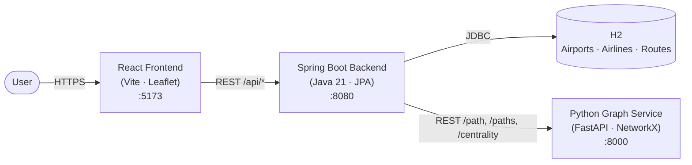

# Flight Network Explorer

**An interactive aviation graph analysis platform.** Explore global airport connectivity, discover routes between destinations, and analyse airline networks through a dynamic world map backed by real graph algorithms.


<!-- Screenshot placeholder — replace with an actual capture of the running app -->
<!--  -->

---

## What it does

- **Interactive world map** — airports rendered as markers, sized by connectivity, on a dark-themed basemap
- **Route discovery** — click any two airports to compare every available route, colour-coded by distance and flight time
- **Dynamic network expansion** — the global graph isn't loaded all at once; airports are expanded on demand, one neighbourhood at a time
- **Hub ranking and centrality** — airports ranked by real graph metrics (degree, betweenness, closeness) computed in a dedicated Python service
- **Airport statistics** — routes, airlines, top destinations, and connections per airport

## Architecture



**Three services, one system:**

| Service | Language | Responsibility |
|---|---|---|
| **Frontend** | React + Vite + Leaflet | Interactive map, search, sidebar, route visualisation |
| **Backend** | Java 21 + Spring Boot | REST API, relational data, imports, entity management |
| **Graph service** | Python + FastAPI + NetworkX | Graph algorithms, path finding, centrality |

The backend owns the **relational** model of the data (airports, airlines, route rows). The graph service owns the **graph** model (nodes and weighted edges). They're separate because they answer different questions:

- "How many airlines fly AMS → LHR?" → **backend**, relational query
- "What's the shortest route AMS → SYD?" → **graph service**, Dijkstra on a 37k-edge graph

## Data

The project uses the [OpenFlights](https://openflights.org/data.html) dataset — a public-domain collection of airports, airlines, and routes.

| Entity | Rows | Source |
|---|---|---|
| Airports | 7,698 | `airports.dat` |
| Airlines | 6,162 | `airlines.dat` |
| Routes (per-airline) | 67,663 | `routes.dat` |
| Unique routes (graph edges) | 37,595 | computed |
| Graph nodes | 3,425 | airports with at least one route |

**Why 67,663 rows become 37,595 edges:** OpenFlights stores routes as one row per (airline, source, destination) triple. The graph service collapses these into single edges — one per physical route — so a flight served by three airlines counts once.

**Why 7,698 airports become 3,425 nodes:** about 4,300 airports in the dataset have no associated routes. They're imported to the backend for lookup purposes but don't appear in the graph.

## Quick start

Three terminals. The graph service is optional but required for route comparison and centrality.

```bash
# Terminal 1 — graph service
cd graph-service
pip install -r requirements.txt
uvicorn app.main:app --reload --port 8000

# Terminal 2 — backend
cd backend
./mvnw spring-boot:run

# Terminal 3 — frontend
cd frontend
npm install
npm run dev
```

Open **http://localhost:5173**.

On first backend start, three importers run automatically (~30 seconds) and populate the H2 database with airports, airlines, and routes. Subsequent starts skip the import.

See [`docs/DEVELOPMENT.md`](./docs/DEVELOPMENT.md) for the full runbook, verification checklist, and troubleshooting.

## API surface

**Backend — `http://localhost:8080`**

| Method | Path | Purpose |
|---|---|---|
| `GET` | `/api/airports/{iata}` | Look up an airport by IATA code |
| `GET` | `/api/network/{iata}` | Airports directly reachable from the given airport |
| `GET` | `/api/airport/{iata}/stats` | Route count, destinations, airlines |
| `GET` | `/api/hubs` | Top-N airports by connectivity (paginated by limit) |
| `GET` | `/api/airlines` | Paginated airline list |
| `GET` | `/api/airlines/{iata}` | Airline by IATA |
| `GET` | `/api/airlines/{iata}/routes` | Routes operated by an airline |
| `GET` | `/api/routes/{from}/{to}` | Route details between two airports |
| `GET` | `/api/routes/compare/{from}/{to}` | Alternative route comparison |
| `GET` | `/api/graph/connections/{iata}` | Pass-through to the graph service |
| `GET` | `/api/graph/path/{from}/{to}` | Weighted shortest path |
| `GET` | `/api/graph/centrality` | Degree / betweenness / closeness ranking |

**Graph service — `http://localhost:8000`**

| Method | Path | Purpose |
|---|---|---|
| `GET` | `/` | Service status and graph size |
| `GET` | `/connections/{iata}` | Direct successors of a node |
| `GET` | `/path/{from}/{to}` | Shortest path by distance (km) |
| `GET` | `/paths/{from}/{to}` | Up to 10 alternative paths, ordered by distance |
| `GET` | `/centrality?metric=&limit=` | Precomputed centrality rankings |

## Project layout

```
FlightNetworkExplorer/
├── backend/           Java 21 · Spring Boot — REST API + persistence
├── graph-service/     Python · FastAPI + NetworkX — graph algorithms
├── frontend/          React · Vite + Leaflet — interactive map
├── data/raw/          OpenFlights source files (.dat)
├── docs/              Development and operations documentation
├── scripts/           verify.sh and utilities
└── README.md          (this file)
```

Each service has its own README with a deep dive:

- [`backend/README.md`](./backend/README.md) — entities, importers, error handling, caching
- [`graph-service/README.md`](./graph-service/README.md) — graph model, algorithms, centrality
- [`frontend/README.md`](./frontend/README.md) — components, state, data flow

## Design decisions

**Directed graph model.** Airline routes are directed edges, not undirected. London → Amsterdam and Amsterdam → London are distinct routes in the data and are treated as such. This matches how the source data is structured and avoids inventing symmetry that doesn't exist.

**Weighted paths.** The graph service weights each edge by distance in kilometres. `nx.shortest_path` with `weight="distance_km"` returns the geometrically shortest path, not the path with fewest hops. A 3-hop route across the North Atlantic can beat a 5-hop route via the Middle East.

**Local graph expansion.** The full 37,595-edge graph is not sent to the browser. The frontend requests a network one airport at a time — `/api/network/{iata}` returns direct connections only. This keeps payloads small and lets users explore without loading everything.

**Separate graph service.** Graph algorithms live in Python (NetworkX) rather than Java. Betweenness centrality on a 3,425-node graph is a five-line call in NetworkX; reimplementing it in Java would be a project in itself. The trade-off is one more process to run and an HTTP hop between services.

**Edge deduplication.** Multiple airlines flying the same physical route collapse into one edge with an `airline` attribute. This is why the graph has 37,595 edges from 67,663 rows. Without deduplication, path finding would still work but the numbers would be misleading.

## License

MIT. See [LICENSE](./LICENSE) if present.