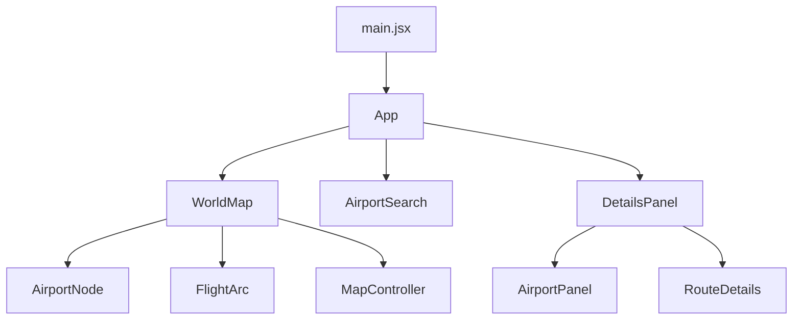
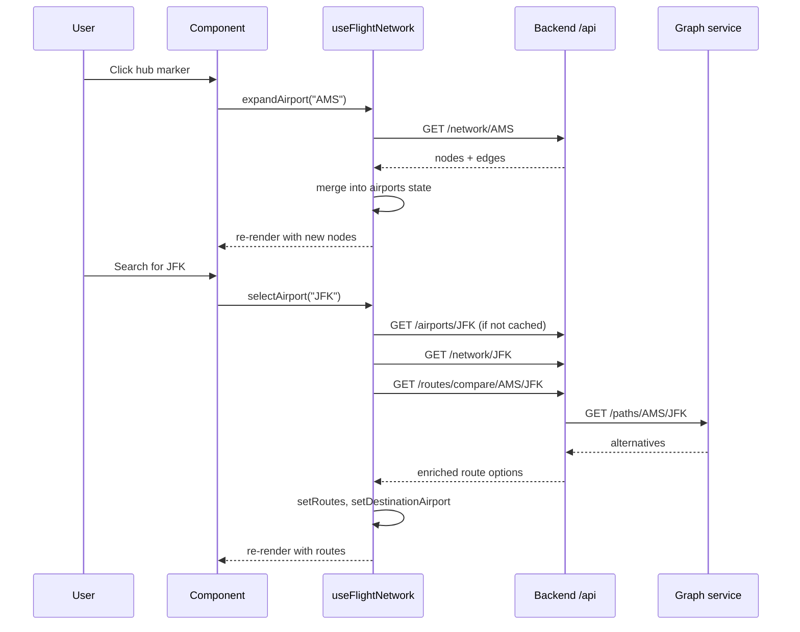

# Frontend — React + Vite + Leaflet

A single-page interactive map for exploring the global airline network. Renders airports as markers, routes as curved great-circle arcs, and provides search, a details sidebar, and route comparison.

Part of the [FlightNetworkExplorer](../README.md) project.

---

## Overview

- **Framework:** React 19
- **Bundler:** Vite
- **Map library:** react-leaflet + Leaflet
- **HTTP client:** axios
- **Styling:** inline styles + a small amount of global CSS
- **Language:** JavaScript (JSX), no TypeScript

The frontend is a **single page** with no routing. All interaction happens on one screen: a full-viewport map, a floating search box, and a right-side details panel that appears when something is selected.

## Requirements

- **Node 18 or newer** — `node --version`
- The [backend](../backend/README.md) running on port 8080
- The [graph service](../graph-service/README.md) running on port 8000 (required for route comparison)

## Running

```bash
cd frontend
npm install
npm run dev
```

Open **http://localhost:5173**.

### Other scripts

| Command | Purpose |
|---|---|
| `npm run dev` | Start the Vite dev server with HMR |
| `npm run build` | Production build to `dist/` |
| `npm run preview` | Serve the production build locally |
| `npm run lint` | Run ESLint |

## Configuration

Create `frontend/.env.local` to override the API base URL:

```properties
VITE_API_URL=http://localhost:8080/api
```

If unset, the client defaults to `http://localhost:8080/api`. All API calls are relative to this base.

## Component tree



**Every component is a pure renderer.** State lives in a single custom hook (`useFlightNetwork`), which `App` calls and passes down as props.

## State management

All feature state lives in **one hook**: `src/hooks/useFlightNetwork.js`.

```js
const network = useFlightNetwork();
```

Returns:

| Property | Type | Meaning |
|---|---|---|
| `airports` | `Airport[]` | Airports currently rendered on the map |
| `focusedAirport` | `Airport \| null` | Last airport the user interacted with |
| `originAirport` | `Airport \| null` | First airport in a route comparison |
| `destinationAirport` | `Airport \| null` | Second airport in a route comparison |
| `routes` | `RouteOption[]` | Route comparison results |
| `selectedRoute` | `RouteOption \| null` | Highlighted route within `routes` |
| `lookup` | `{ [iata]: Airport }` | Fast IATA → airport map |
| `activeAirports` | `Set<string> \| null` | Airports on the current route paths |
| `expandAirport(iata)` | `async` | Fetch and add an airport's direct network |
| `selectAirport(iata)` | `async` | Select an airport (origin or destination) |
| `selectRoute(route)` | `void` | Highlight a route |
| `clearSelection()` | `void` | Reset all selection state |

**Actions are wrapped in `useCallback`** so their identities are stable across renders, letting child components skip re-renders when nothing they care about changed.

**Inflight deduplication:** `expandAirport` tracks in-progress requests in a `useRef<Set>` — the same airport expanded twice in quick succession fires only one HTTP request.

## Data flow



## Key components

### `App.jsx`

Top-level layout. Owns the `useFlightNetwork()` call and distributes state/callbacks to children. Renders:

- `WorldMap` — full-viewport
- `AirportSearch` — floating at top-left
- `DetailsPanel` — right-side overlay

### `components/map/WorldMap.jsx`

Renders the Leaflet `<MapContainer>` and its children:

- `<MapController>` — programmatically flies the camera when the selected airport changes
- `<TileLayer>` — OpenStreetMap tiles with a CSS filter for a dark theme
- `<AirportNode>` — one per airport in `network.airports`
- `<FlightArc>` — one per route leg when route comparison is active

Receives `network` as a prop and forwards individual pieces to children.

### `components/map/AirportNode.jsx`

A single Leaflet `<Marker>`. Uses a `L.divIcon` with a CSS-based glow. Marker size scales with `airport.connections`. Colour reflects role:

- **Cyan** — origin
- **Red/pink** — destination
- **White** — normal
- **Faded grey** — not part of the current route (dimmed when a comparison is active)

Click handlers:
- **Single click** → expand the airport's network
- **Double click** → select as origin or destination

A Leaflet popup shows airport details on hover.

### `components/map/FlightArc.jsx`

Renders a route leg as a curved polyline following the **great-circle path** between two airports.

The curve is computed with **spherical linear interpolation (slerp)** on 3D unit vectors — 25 points along the great circle. This produces realistic curvature: AMS → LAX bows north over Greenland, AMS → SYD bows east over Asia.

Colour:
- **Cyan** — fastest route (highlighted)
- **Green** — shortest by distance
- **Red** — longest
- **White** — default

Selected arcs animate with a dash pattern.

### `components/details/DetailsPanel.jsx`

Right-side overlay. Shows one of:

- **`AirportPanel`** — when a single airport is selected
- **`RouteDetails`** — when two airports are selected and routes are available

Returns `null` when nothing is selected (the panel disappears entirely).

### `components/AirportPanel.jsx`

Airport details + statistics. On mount, fetches `/api/airport/{iata}/stats`. Shows:

- Airport name, city, country
- Route count, outgoing count, incoming count
- Top 10 destinations (sorted by frequency)
- Airlines serving the airport

Handles loading and error states.

### `components/RouteDetails.jsx`

Renders the route comparison results. Each route option shows:

- Sequence of airports (with stop count)
- Total distance
- Estimated flight time
- Airlines operating each leg
- Badges indicating fastest, shortest, most/least stops

Clicking a route highlights it on the map (via `onSelectRoute`).

### `components/AirportSearch.jsx`

Search box for jumping to an airport by IATA code. On submit:

1. Validates the input is 3 letters
2. Verifies the airport exists (`GET /api/airports/{iata}`)
3. Calls `onSelect(iata)` on success

Shows inline status: `Searching…`, `Airport not found`, or `Enter a 3-letter IATA code`.

## API integration

All HTTP calls go through `src/api/client.js`:

```js
import axios from "axios";

const client = axios.create({
  baseURL: import.meta.env.VITE_API_URL || "http://localhost:8080/api",
});

client.interceptors.response.use(
  (response) => response,
  (error) => {
    console.error("API Error:", error.response?.data || error.message);
    return Promise.reject(error);
  },
);
```

Components import `client` and call `client.get(...)` directly. Endpoints used:

| Endpoint | Called from |
|---|---|
| `GET /hubs` | `useFlightNetwork` (initial load) |
| `GET /network/{iata}` | `useFlightNetwork.expandAirport` |
| `GET /airports/{iata}` | `useFlightNetwork.selectAirport`, `AirportSearch` |
| `GET /routes/compare/{from}/{to}` | `useFlightNetwork.selectAirport` |
| `GET /airport/{iata}/stats` | `AirportPanel` |

## Tile provider

The map uses **OpenStreetMap** standard tiles, transformed into a dark theme with a CSS filter:

```css
.map-tiles-dark {
  filter: invert(1) hue-rotate(180deg) brightness(0.85) contrast(0.9)
    saturate(0.8);
}
```

This avoids requiring an API key while still matching the app's dark aesthetic. The trade-off is that label text appears inverted (dark text on light background) — readable but not as clean as a true dark basemap.

To switch to a proper dark provider (e.g. Stadia Maps, CartoDB with key), replace the `<TileLayer>` URL in `WorldMap.jsx` and remove the `map-tiles-dark` class.

## Build

```bash
npm run build
```

Produces a static bundle in `dist/`. Serve with any static file server (`npm run preview` for local testing).

The dev server calls the backend at `http://localhost:8080/api` — in production, either serve both from the same origin or set `VITE_API_URL` at build time.

## Testing

No tests yet. Recommended setup:

```bash
npm install -D vitest @testing-library/react @testing-library/jest-dom jsdom
```

Tests live alongside components as `*.test.jsx`. Priorities:

1. **`useFlightNetwork`** — the core logic; testable without a DOM
2. **`AirportSearch`** — validation, submit, error states
3. **`AirportPanel`** — loading, error, populated states
4. **`DetailsPanel`** — which child renders based on props

## Known limitations

### Dead files

Three components are not wired up: `NetworkMap.jsx`, `FlightMap.jsx`, and `ConnectionList.jsx`. They were built for a secondary "graph view" that isn't mounted. They can be removed or wired in later.

### Duplicate console logging

`client.js` logs every API error, and some components log their own errors. In production, this could be consolidated behind a single error boundary.

### No routing

The app is deliberately single-page. Deep-linking to a specific airport or route isn't supported. Adding `react-router-dom` would enable URLs like `/airport/AMS`, but also adds complexity — it's a deliberate omission.

### Bundle size

Leaflet and React together are ~200 KB gzipped. For a map-first app this is acceptable, but the initial load can be improved with code-splitting if needed.

### Field naming quirks

Some fields on the API have names that don't quite match their semantics:

- `HubDTO.connections` — actually a combined degree (departures + arrivals), not a count of distinct connections
- `RouteOption.fastest` / `shortest` — the flags are set correctly, but when only one route exists it's both fastest and shortest, which reads oddly

Renaming these would change the API contract; they're noted here for awareness.

### Tile provider

OpenStreetMap tiles are provided under their [tile usage policy](https://operations.osmfoundation.org/policies/tiles/), which limits heavy usage. For a production deployment with significant traffic, switch to a commercial tile provider.

---

*Part of [FlightNetworkExplorer](../README.md). See also the [backend](../backend/README.md) and [graph service](../graph-service/README.md).*