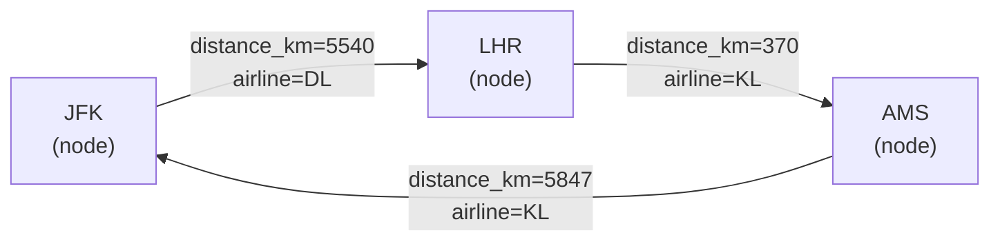

# Graph Service — FastAPI + NetworkX

A Python service that models the global airline network as a weighted directed graph and answers path-finding and centrality queries. Runs on port **8000** by default.

Part of the [FlightNetworkExplorer](../README.md) project.

---

## Overview

- **Language:** Python 3.11+
- **Framework:** FastAPI
- **Graph library:** NetworkX
- **Server:** Uvicorn
- **Graph model:** directed (`nx.DiGraph`), weighted by distance in kilometres

The backend calls this service for:
- Direct neighbours of a node (`/connections`)
- Shortest path between two airports by distance (`/path`)
- Alternative paths, ordered by distance (`/paths`)
- Precomputed centrality rankings (`/centrality`)

## Requirements

- **Python 3.11 or newer** — `python3 --version`
- **Uvicorn** — installed via `requirements.txt`

## Running

```bash
cd graph-service
pip install -r requirements.txt
uvicorn app.main:app --reload --port 8000
```

**Note:** the module:attribute syntax is `app.main:app`, not `app.main.py:app`. The `.py` suffix is a common mistake.

### Startup output

```
Loaded graph: 3425 airports, 37595 unique routes (NNNNN with computed distance, M with fallback)
Computing centrality metrics (may take ~15 seconds)...
Centrality precomputed for 3 metrics
INFO:     Application startup complete.
```

**Startup cost:** the graph loads in 1–2 seconds. Centrality precomputation adds **~15 seconds** because betweenness centrality is expensive on a 3,425-node graph. Total startup: **~17 seconds**.

Precomputation is done at startup so that HTTP requests return instantly — a cold betweenness call would otherwise take 10+ seconds and time out the backend's 5-second read timeout.

## Configuration

Environment variables:

| Variable | Default | Purpose |
|---|---|---|
| `ROUTES_FILE` | `../data/raw/routes.dat` | Path to the OpenFlights routes file |
| `AIRPORTS_FILE` | `../data/raw/airports.dat` | Path to the OpenFlights airports file (for coordinates) |

Both paths are resolved **relative to the working directory** — run the service from `graph-service/` for the defaults to work.

**Why airports are needed:** the service computes each edge's `distance_km` from the coordinates of its endpoints. The airports file provides those coordinates.

## Graph model



**Nodes:** airports with at least one route in the dataset (IATA code as the node ID).

**Edges:** directed, one per (source, destination) pair. Multiple airlines flying the same physical route **collapse into a single edge**. The `airline` attribute stores the last airline seen — the graph is optimised for topology, not carrier attribution.

**Edge attributes:**
- `distance_km` (float) — Haversine distance between the two airports
- `airline` (string) — the last airline that was processed for this edge

### Edge deduplication

The source file has **67,663 route rows** — one per (airline, source, destination). The graph has **37,595 unique edges** because `nx.DiGraph.add_edge()` overwrites existing edges for the same pair.

This is deliberate:
- Path finding is about **topology**, not carriers. Two airlines flying AMS → LHR is one physical link.
- Keeping duplicates would make `shortest_path` consider redundant edges with identical weights, with no benefit.

If you ever need per-airline edges (e.g. "shortest KLM-only path"), use a `MultiDiGraph` and filter by the `airline` attribute.

### Distance fallback

Some routes reference airports that have no coordinates in `airports.dat` (or were dropped during airport import). For those edges, `distance_km` is set to **`500.0`** as a mid-range estimate.

Without a fallback, NetworkX would treat those edges as weight `1` (the default for missing weights), making them look nearly free and skewing shortest-path results toward paths that traverse unknown edges.

The startup log reports how many edges received the fallback.

## Endpoints

### `GET /`

Health check and graph summary.

```json
{
  "service": "flight graph",
  "status": "running",
  "airports": 3425,
  "routes": 37595
}
```

### `GET /connections/{airport}`

Direct successors of a node.

```json
{
  "airport": "AMS",
  "connections": ["LHR", "CDG", "FRA", "JFK", "..."]
}
```

Returns `{ "airport": "AMS", "connections": [] }` for airports with no outbound routes, and for airports not in the graph.

### `GET /path/{source}/{destination}`

Shortest path by **distance in kilometres** (Dijkstra on the weighted graph).

```json
{
  "from": "AMS",
  "to": "JFK",
  "path": ["AMS", "JFK"]
}
```

**404** if no path exists between the two nodes:

```json
{ "detail": "No path found between AMS and JFK" }
```

Because the graph is weighted, a route with **fewer hops** is not necessarily returned — a 2-hop path via a closer intermediate airport beats a 1-hop path that spans a longer distance, if the intermediate is on the way.

### `GET /paths/{source}/{destination}`

Up to **10 alternative paths**, ordered by total distance (`nx.shortest_simple_paths` with `weight="distance_km"`).

```json
{
  "from": "AMS",
  "to": "JFK",
  "paths": [
    ["AMS", "JFK"],
    ["AMS", "LHR", "JFK"],
    ["AMS", "CDG", "JFK"]
  ]
}
```

**404** if no paths exist.

### `GET /centrality?metric=&limit=`

Precomputed centrality rankings. Returns the top N airports for the requested metric.

| Parameter | Values | Default |
|---|---|---|
| `metric` | `degree`, `betweenness`, `closeness` | `degree` |
| `limit` | 1–500 | 50 |

```json
{
  "metric": "degree",
  "results": [
    {"iata": "FRA", "score": 0.139311},
    {"iata": "CDG", "score": 0.137266},
    {"iata": "AMS", "score": 0.135222}
  ]
}
```

#### What the metrics mean

| Metric | Interpretation |
|---|---|
| **Degree** | Fraction of the graph directly reachable in one hop. High-degree nodes are **hubs**. |
| **Betweenness** | Fraction of all shortest paths that pass through this node. High-betweenness nodes are **bridges** — removing them disconnects the network. |
| **Closeness** | Inverse of the average distance to every other node. High-closeness nodes are **centrally located**. |

Degree and hubs often agree. Betweenness and closeness frequently surface **different** airports — an airport can be poorly connected (low degree) but sit on the only route between two regions (high betweenness).

#### Why precomputed

- **Degree** is fast — a single pass over edges.
- **Closeness** is O(n × (n + m)) — a few seconds on this graph.
- **Betweenness** is the slowest — ~10 seconds on this graph.

All three are computed once in the `lifespan` startup hook and held in memory. Requests hit the cache and return in microseconds.

**Memory:** the three centrality dicts together are a few hundred KB.

## Design notes

### Why a separate service?

Graph algorithms live in Python because NetworkX provides them in a few lines. The same algorithms in Java would need a graph library (JGraphT) and considerably more code. The cost is one extra process and an HTTP hop — acceptable for this use case.

### Why directed?

Airline routes in OpenFlights are directed. London → Amsterdam and Amsterdam → London appear as separate rows and represent distinct operations. Treating the graph as undirected would invent symmetry that isn't in the data.

### Why weight by distance?

`nx.shortest_path` without weights uses **hop count**. On a global airline graph, that's often misleading: a 2-hop route via a distant hub can be 40% longer than a 3-hop route that hugs the great circle. Weighting by distance makes "shortest path" match intuition.

The distance is computed with the Haversine formula on airport coordinates — the same formula the backend uses, giving consistent numbers.

### Why deduplicate edges?

See "Edge deduplication" above. Short version: one physical route, one edge.

### Why precompute centrality?

Because betweenness is expensive. See "Why precomputed" above.

## Testing

No tests yet. Recommended setup:

```bash
pip install pytest httpx
```

Test file layout:

```
graph-service/
└── tests/
    ├── conftest.py          # fixtures: a small synthetic graph
    ├── test_graph_loader.py # load, neighbours, path, centrality
    └── test_endpoints.py    # FastAPI TestClient
```

Example:

```python
from fastapi.testclient import TestClient
from app.main import app

client = TestClient(app)

def test_root():
    r = client.get("/")
    assert r.status_code == 200
    assert r.json()["status"] == "running"

def test_connections_ams():
    r = client.get("/connections/AMS")
    assert r.status_code == 200
    assert r.json()["airport"] == "AMS"
```

Run: `cd graph-service && pytest`

## Troubleshooting

### `Loaded graph: 0 airports, 0 routes`

The routes file wasn't found or couldn't be parsed.

```bash
ls -la data/raw/routes.dat     # check from repo root
ls -la ../data/raw/routes.dat  # check from graph-service/
```

The default path is `../data/raw/routes.dat` — relative to the working directory. Run uvicorn **from `graph-service/`**, or set `ROUTES_FILE` explicitly.

### `Error loading ASGI app. Import string "app.main.py" must be in format "<module>:<attribute>"`

The command should be:

```bash
uvicorn app.main:app --reload --port 8000
```

Not `app.main.py:app`. The `.py` suffix is not part of the module path.

### Startup takes a long time

Expected. Centrality precomputation adds ~15 seconds. The first log line (`Loaded graph: ...`) appears within 1–2 seconds; the centrality messages follow after the computation finishes. If it takes longer than ~30 seconds, the graph is probably very large — check the node/edge counts.

### `Unsupported upgrade request` in uvicorn log

The backend's `HttpClient` tries an h2c upgrade by default; uvicorn doesn't support it. The backend forces HTTP/1.1 in `GraphServiceConfig`. If you see this warning, the backend's config may have regressed.

### `/path` returns a very different route than expected

Two possibilities:

1. **Weighting is missing** — check that `shortest_path` in `graph_loader.py` uses `weight="distance_km"`. Without it, NetworkX falls back to hop count.
2. **The fallback distance is skewing results** — a route with an unknown-coordinate hop gets `500.0` km. If many of your route endpoints have missing coordinates, the fallback dominates. Check the startup log for the fallback count.

### Centrality rankings look wrong

Verify the graph loaded fully — the number of nodes and edges in the startup log should match the backend's expectations. If the graph is truncated (e.g. a bad `ROUTES_FILE`), centrality is computed on a partial network.

---

*Part of [FlightNetworkExplorer](../README.md). See also the [backend](../backend/README.md) and [frontend](../frontend/README.md).*